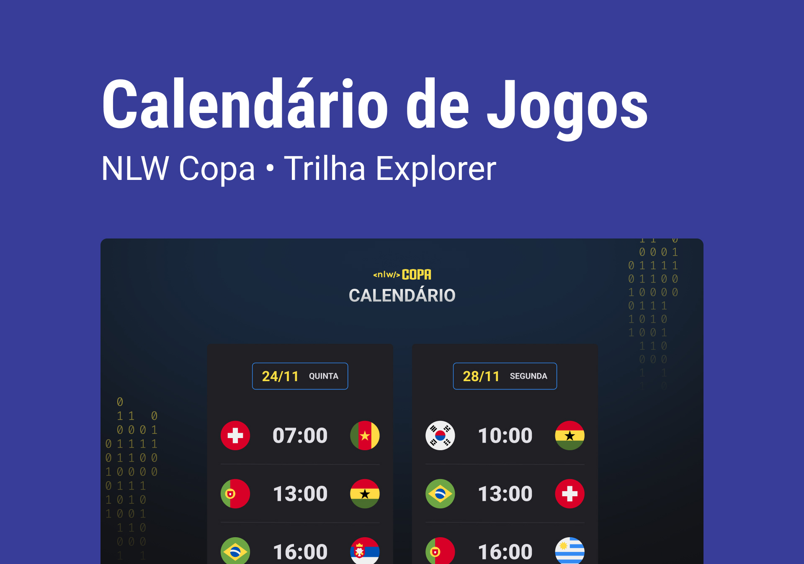

<h1 align="center"> NLW #10 - Copa do Mundo </h1>

  <a href="#-projeto">Projeto</a>&nbsp;&nbsp;&nbsp;|&nbsp;&nbsp;&nbsp;
  <a href="#-tecnologias">Tecnologias</a>&nbsp;&nbsp;&nbsp;|&nbsp;&nbsp;&nbsp;
  <a href="#-layout">Layout</a>&nbsp;&nbsp;&nbsp;|&nbsp;&nbsp;&nbsp;
  <a href="#memo-licença">Licença</a>

  

## 💻 Projeto

Este projeto foi desenvolvido no evento exclusivo e gratuito, promovido pela [Rocketseat Education](https://github.com/rocketseat-education) para ensino de tecnologias WEB, em que criamos um calendário personalizado dos jogos da Copa 2022.

_**Veja o resultado [clicando aqui](beaasb.github.io/NLW-10-Copa/)**_

## 🚀 Tecnologias 
Esse projeto foi desenvolvido com as seguintes tecnologias:

    - HTML
    - CSS
    - Git e GitHub
    - JavaScript

## 🔖 Layout

Você pode visualizar o layout do projeto através [desse link](https://www.figma.com/file/J1Z33MISC22YZB8wfxiIns/NLW-Copa-Explorer/duplicate). 

É necessário ter conta no [Figma](https://figma.com) para acessá-lo.
   
## :memo: Licença

Esse projeto está sob a licença MIT. Veja o arquivo [LICENSE](LICENSE) para mais detalhes.

## ✉️ Contatos
    
  
    
   
    
---

Feito com ♥ by Bea :wave: